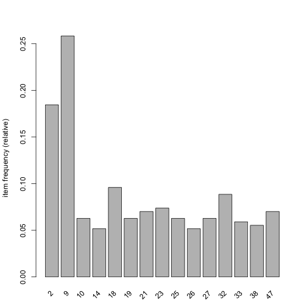
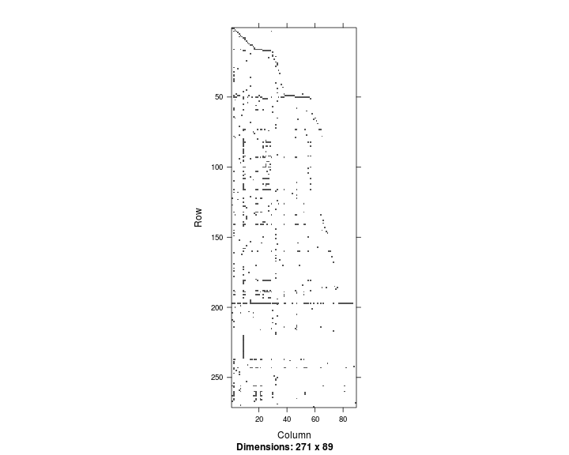
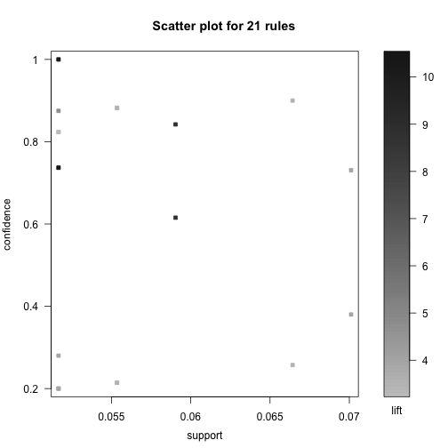
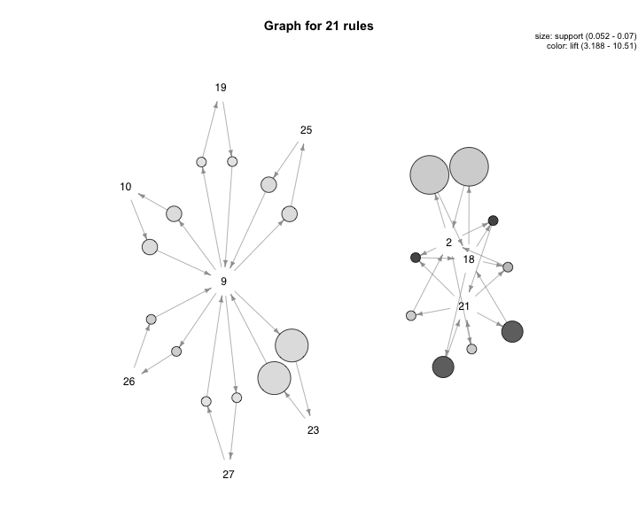

Criando regras de associação a partir do log de um servidor web
===============================================================

No script **tratando_web_log.Rmd** foi apresentado como transformar um log padrão de um servidor web em um conjunto de transações. 

Neste script nós vamos apresentar como identificar regras de associação a partir do conjunto de transações. Para isto, nós vamos precisar de dois pacotes (arules e arulesViz) e carregar os arquivos criados no script anterior.


```r
library(arules)
library(arulesViz)

load("../data/transacoes.rda")
load("../data/urls.rda")
```


O dataset que será analisado possui as seguintes características:


```r
transacoes
```

```
## transactions in sparse format with
##  271 transactions (rows) and
##  89 items (columns)
```


Os itens que possuem suporte igual ou superior são ilustrados no gráfico abaixo:


```r
itemFrequencyPlot(transacoes, support = 0.05)
```

 


As URLs são:


```r
subset(hash, hash$key == "2" | hash$key == "9" | hash$key == "18" | hash$key == 
    "32")
```

```
##                                      value key
## 2                                        /   2
## 9               /materiais/webMiningR.html   9
## 18                         /materiais.html  18
## 32 /materiais/docs/ia/buscaCompetitiva.pdf  32
```


A URL com valor **/** é a página raiz do site [http://fbarth.net.br/](http://fbarth.net.br). As demais URLs são páginas que estão dentro do link **materiais** do site.

Um gráfico útil para visualizar as transações é apresentado abaixo. Neste gráfico, cada linha é uma seção e cada coluna é um documento (url).


```r
image(transacoes)
```

 


As regras podem ser geradas utilizando o algoritmo **apriori**:


```r
rules <- apriori(transacoes, parameter = list(supp = 0.05, conf = 0.2, minlen = 2))
```

```
## 
## parameter specification:
##  confidence minval smax arem  aval originalSupport support minlen maxlen
##         0.2    0.1    1 none FALSE            TRUE    0.05      2     10
##  target   ext
##   rules FALSE
## 
## algorithmic control:
##  filter tree heap memopt load sort verbose
##     0.1 TRUE TRUE  FALSE TRUE    2    TRUE
## 
## apriori - find association rules with the apriori algorithm
## version 4.21 (2004.05.09)        (c) 1996-2004   Christian Borgelt
## set item appearances ...[0 item(s)] done [0.00s].
## set transactions ...[89 item(s), 271 transaction(s)] done [0.00s].
## sorting and recoding items ... [15 item(s)] done [0.00s].
## creating transaction tree ... done [0.00s].
## checking subsets of size 1 2 3 done [0.00s].
## writing ... [21 rule(s)] done [0.00s].
## creating S4 object  ... done [0.00s].
```

```r
inspect(rules)
```

```
##    lhs     rhs  support confidence   lift
## 1  {27} => {9}  0.05166     0.8235  3.188
## 2  {9}  => {27} 0.05166     0.2000  3.188
## 3  {25} => {9}  0.05535     0.8824  3.416
## 4  {9}  => {25} 0.05535     0.2143  3.416
## 5  {26} => {9}  0.05166     1.0000  3.871
## 6  {9}  => {26} 0.05166     0.2000  3.871
## 7  {10} => {9}  0.05535     0.8824  3.416
## 8  {9}  => {10} 0.05535     0.2143  3.416
## 9  {23} => {9}  0.06642     0.9000  3.484
## 10 {9}  => {23} 0.06642     0.2571  3.484
## 11 {19} => {9}  0.05166     0.8235  3.188
## 12 {9}  => {19} 0.05166     0.2000  3.188
## 13 {21} => {18} 0.05904     0.8421  8.777
## 14 {18} => {21} 0.05904     0.6154  8.777
## 15 {21} => {2}  0.05166     0.7368  3.994
## 16 {2}  => {21} 0.05166     0.2800  3.994
## 17 {18} => {2}  0.07011     0.7308  3.961
## 18 {2}  => {18} 0.07011     0.3800  3.961
## 19 {18,                                  
##     21} => {2}  0.05166     0.8750  4.742
## 20 {2,                                   
##     21} => {18} 0.05166     1.0000 10.423
## 21 {2,                                   
##     18} => {21} 0.05166     0.7368 10.510
```


Através do comando abaixo é possível criar um plot que apresenta o valor de __suporte__, __confiança__ e __lift__ para cada uma das regras.


```r
plot(rules)
```

 


Um outra imagem, que eu considero muito útil, é a imagem que apresenta as regras na forma de grafo. Trata-se de um grafo direcionado onde o lado esquerdo da regra aponta para o lado direito da regra. Os nodos do grafo são as URLs e as arestas são as regras. Em cada aresta é apresentado o __suporte__ e __lift__ da regra através do tamanho e da cor do círculo da aresta, respectivamente.

Este grafo sumariza as regras identificadas. Através da análise visual deste grafo é fácil perceber a relação entre as URLs **19, 23, 27, 10, 26 e 25** com a URL **9** (abaixo são apresentados os nomes das URLs). E também é fácil perceber relação entre as URLs *2, 18 e 21*.


```r
plot(rules, method = "graph", control = list(type = "items"))
```

 


As URLs apresentadas na imagem acima são:


```r
subset(hash, hash$key == "2" | hash$key == "21" | hash$key == "18")
```

```
##                          value key
## 2                            /   2
## 18             /materiais.html  18
## 21 /materiais/disciplinas.html  21
```


Neste caso, a URL com número **21** é um item do menu da URL **2** e a URL com número **18** é um item do menu da URL **21**.


```r
subset(hash, hash$key == "19" | hash$key == "23" | hash$key == "27" | hash$key == 
    "10" | hash$key == "26" | hash$key == "25" | hash$key == "9")
```

```
##                         value key
## 9  /materiais/webMiningR.html   9
## 10 /materiais/docs/aula05.pdf  10
## 19  /materiais/palestras.html  19
## 23 /materiais/docs/aula01.pdf  23
## 25 /materiais/docs/aula03.pdf  25
## 26 /materiais/docs/aula04.pdf  26
## 27 /materiais/docs/aula06.pdf  27
```


Todas URLs descritas acima, exceto a URL de número **19** ([/materiais/palestras.html](http://fbarth.net.br/materiais/palestras.html)), fazem parte do material do mesmo curso, que está na mesma URL principal [http://fbarth.net.br/materiais/webMiningR.html](http://fbarth.net.br/materiais/webMiningR.html).
