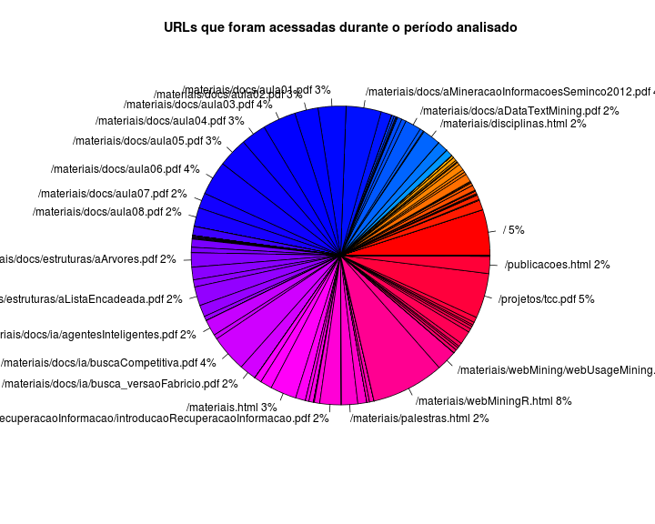

Pré-processamento de um log de servidor web para a mineração de padrões
=======================================================================


Este relatório é o primeiro de um conjunto de relatórios onde o objetivo é ilustrar a utilização da linguagem de programação R na mineração de padrões em servidores Web.

O objetivo deste relatório é descrever a etapa de transformação do log padrão de um servidor web para uma estrutura de dados manipulável por algoritmos de __data mining__.

Para ilustrar o funcionamento dos algoritmos será utilizado um log do site [http://fbarth.net.br](http://fbarth.net.br). Este log está no arquivo **../data/20130620_access.log** e pode ser acessado no ambiente R através do seguinte comando:


```r
access_log <- read.table("../data/20130620_access.log")
```


Exemplo de registro no arquivo de log:


```r
access_log[1, ]
```

```
##              V1 V2 V3                    V4     V5
## 1 66.249.73.206  -  - [20/Jun/2013:03:19:05 +0000]
##                                                   V6  V7 V8 V9
## 1 GET /materiais/docs/estruturas/aFilas.pdf HTTP/1.1 304  0  -
##                                                                                                    V10
## 1 DoCoMo/2.0 N905i(c100;TB;W24H16) (compatible; Googlebot-Mobile/2.1; +http://www.google.com/bot.html)
```


Para acessar cada uma das variáveis de forma independente, basta acessar algumas das colunas da tabela aplicando algumas regres de expressão regular:


```r
ip <- access_log[, 1]
time <- as.Date(gsub(":[0-9]+", "", gsub("\\[", "", access_log[, 4])), "%d/%B/%Y")
url <- gsub(" HTTP/1.0", "", gsub(" HTTP/1.1", "", gsub("GET ", "", access_log[, 
    6])))
status <- access_log[, 7]
ref <- access_log[, 9]
agent <- access_log[, 10]
```


Todas as variáveis identificadas acima podem fazer parte de um mesmo dataset:


```r
dataset <- data.frame(ip, time, url, ref, status, agent)
dim(dataset)
```

```
## [1] 3439    6
```

```r
head(dataset)
```

```
##                ip       time                                         url
## 1   66.249.73.206 2013-06-20       /materiais/docs/estruturas/aFilas.pdf
## 2 193.105.210.216 2013-06-20   /materiais/docs/estruturas/aOrdenacao.pdf
## 3 193.105.210.216 2013-06-20                                           /
## 4   66.249.73.206 2013-06-20             /materiais/docs/soujava2008.pdf
## 5   94.228.220.68 2013-06-20           /templates/system/css/toolbar.css
## 6   66.249.73.206 2013-06-20 /materiais/docs/am/analiseDescritiva_v3.pdf
##                                                             ref status
## 1                                                             -    304
## 2 http://fbarth.net.br/materiais/docs/estruturas/aOrdenacao.pdf    200
## 3                                         http://fbarth.net.br/    200
## 4                                                             -    304
## 5                                                             -    404
## 6                                                             -    304
##                                                                                                  agent
## 1 DoCoMo/2.0 N905i(c100;TB;W24H16) (compatible; Googlebot-Mobile/2.1; +http://www.google.com/bot.html)
## 2                                    Mozilla/5.0 (Windows NT 6.2; rv:16.0) Gecko/20100101 Firefox/16.0
## 3                                    Mozilla/5.0 (Windows NT 6.2; rv:16.0) Gecko/20100101 Firefox/16.0
## 4                             Mozilla/5.0 (compatible; Googlebot/2.1; +http://www.google.com/bot.html)
## 5                             Mozilla/5.0 (compatible; Googlebot/2.1; +http://www.google.com/bot.html)
## 6                             Mozilla/5.0 (compatible; Googlebot/2.1; +http://www.google.com/bot.html)
```


Podemos também eliminar as variáveis que não vamos mais utilizar no workspace:


```r
remove(agent)
remove(ip)
remove(ref)
remove(status)
remove(time)
remove(url)
remove(access_log)
```


Remoção de registros irrelevantes
---------------------------------

Depois de criado o dataset, é possível analisar o seu conteúdo e eliminar alguns registros, como por exemplo: acessos que não retornaram documentos ou acessos realizados por __crawlers__.


```r
table(dataset$status)
```

```
## 
##  200  206  301  302  304  401  404  499 
## 1846  324    5    5  216    2 1039    2
```

```r
# eliminando todos os registros not found
dataset <- subset(dataset, dataset$status != "404")
# excluindo todas as transacoes que tem uma chamada HEAD para a URL
dataset <- dataset[!grepl("HEAD", dataset$url), ]

# excluindo todas as URLs que possuem a palavra estatisticas
dataset <- dataset[!grepl("estatisticas", dataset$url), ]

# excluindo qualquer acesso a imagens do formato gif e jpg alem de
# arquivos do tipo css
dataset <- dataset[!grepl("gif", dataset$url), ]
dataset <- dataset[!grepl("jpg", dataset$url), ]
dataset <- dataset[!grepl("css", dataset$url), ]

# excluindo links com esta estrutura C= ou O= para eliminar acessos feitos
# por robos
dataset <- dataset[!grepl("C=", dataset$url), ]
dataset <- dataset[!grepl("O=", dataset$url), ]

# eliminar a pagina robots.txt
dataset <- dataset[!grepl("robots.txt", dataset$url), ]

# eliminando todos os acessos feitos via Googlebot
dataset <- dataset[!grepl("Googlebot", dataset$agent), ]
# eliminando todos os acessos feitos via bingbot
dataset <- dataset[!grepl("bingbot", dataset$agent), ]
# eliminando todos os acessos feitos via wotbox.com/bot
dataset <- dataset[!grepl("wotbox", dataset$agent), ]
# eliminando todos os acessos feitos via YandexBot
dataset <- dataset[!grepl("YandexBot", dataset$agent), ]
# eliminando todos os acessos feitos via Sitemaps Generator
dataset <- dataset[!grepl("Sitemaps Generator", dataset$agent), ]
```


```r
slices <- 100 * table(dataset$ip)/length(dataset$ip)
pct <- round(slices/sum(slices) * 100)
lbls <- ifelse(pct > 2, paste(levels(dataset$ip), paste(pct, "%", sep = "")), 
    "")
pie(slices, labels = lbls, col = rainbow(length(lbls)), main = "IPs que acessaram o site durante o período analisado")
```

 


```r
slices <- 100 * table(dataset$url)/length(dataset$url)
pct <- round(slices/sum(slices) * 100)
lbls <- ifelse(pct > 1, paste(levels(dataset$url), paste(pct, "%", sep = "")), 
    "")
pie(slices, labels = lbls, col = rainbow(length(lbls)), main = "URLs que foram acessadas durante o período analisado")
```

 


Descoberta das seções
---------------------

Com a filtragem de dados finalizadas. A próxima etapa será identificar as seções. Para este trabalho a regra será bem simples: um registro com o mesmo __ip__, __dia__ e __agent__ será uma mesma seção.

Código para definir a mesma seção:

```r
cont <- 1
hash <- data.frame(paste(dataset[1, 1], dataset[1, 2], dataset[1, 6]), cont)
names(hash) <- c("value", "key")
s <- c()
s[1] <- (subset(hash, hash$value == (paste(dataset[1, 1], dataset[1, 2], dataset[1, 
    6])))$key)

for (i in 2:dim(dataset)[1]) {
    if (!((paste(dataset[i, 1], dataset[i, 2], dataset[i, 6])) %in% hash$value)) {
        cont <- cont + 1
        hash <- rbind(hash, data.frame(value = (paste(dataset[i, 1], dataset[i, 
            2], dataset[i, 6])), key = cont))
        s[i] <- (subset(hash, hash$value == (paste(dataset[i, 1], dataset[i, 
            2], dataset[i, 6])))$key)
    } else {
        s[i] <- (subset(hash, hash$value == (paste(dataset[i, 1], dataset[i, 
            2], dataset[i, 6])))$key)
    }
}
dataset["session"] <- as.factor(s)
remove(hash)
remove(cont)
remove(i)
remove(s)
plot(table(dataset$session))
```

 


Para facilitar a visualização das regras, as URLs serão convertidas para URLs curtas.


```r
cont <- 1
hash <- data.frame(dataset[1, 3], cont)
names(hash) <- c("value", "key")
s <- c()
s[1] <- (subset(hash, hash$value == (dataset[1, 3]))$key)

for (i in 2:dim(dataset)[1]) {
    if (!(dataset[i, 3] %in% hash$value)) {
        cont <- cont + 1
        hash <- rbind(hash, data.frame(value = (dataset[i, 3]), key = cont))
        s[i] <- (subset(hash, hash$value == (dataset[i, 3]))$key)
    } else {
        s[i] <- (subset(hash, hash$value == (dataset[i, 3]))$key)
    }
}

dataset["short_url"] <- as.factor(s)

remove(cont)
remove(i)
remove(s)

plot(table(dataset$short_url))
```

 


Criação da matriz de transações
-------------------------------

Até este momento temos um dataset com os seguintes atributos:


```r
names(dataset)
```

```
## [1] "ip"        "time"      "url"       "ref"       "status"    "agent"    
## [7] "session"   "short_url"
```


A partir deste dataset é necessário criar uma matriz de transações onde para cada seção são apresentadas as URLs acessadas naquela seção.


```r
library(arules)
tabela <- table(dataset$session, dataset$short_url)
class(tabela) <- "matrix"
transacoes <- as(tabela, "transactions")
```


```r
transacoes
```

```
## transactions in sparse format with
##  271 transactions (rows) and
##  89 items (columns)
```


Depois de criada a estrutura que armazena as transações então podemos salvá-la utilizando o formado **rda** do próprio R. Para isto basta executar o comando __save(transacoes, file="../data/transacoes.rda")__. Também podemos salvar a tabela original (__save(tabela, file="../data/tabela.rda")__) e o nome das URLs (__save(hash, file="../data/urls.rda")__).

