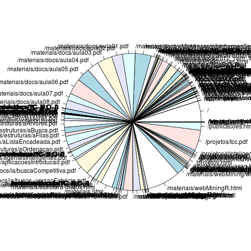

Pré-processamento de um log de servidor web para a mineração de padrões
=======================================================================


Este relatório é o primeiro de um conjunto de relatórios onde o objetivo é ilustrar a utilização da linguagem de programação R na mineração de padrões em servidores Web.

O objetivo deste relatório é descrever a etapa de transformação do log de um servidor web para uma estrutura de dados manipulável por algoritmos de __data mining__.

Para ilustrar o funcionamento dos algoritmos será utilizado um log do site [http://fbarth.net.br](http://fbarth.net.br). Este log está no arquivo **../data/20130620_access.log** e pode ser acessado no ambiente R através do seguinte comando:


```r
access_log <- read.table("../data/20130620_access.log")
```


Exemplo de registro no arquivo de log:


```r
access_log[1, ]
```

```
##              V1 V2 V3                    V4     V5
## 1 66.249.73.206  -  - [20/Jun/2013:03:19:05 +0000]
##                                                   V6  V7 V8 V9
## 1 GET /materiais/docs/estruturas/aFilas.pdf HTTP/1.1 304  0  -
##                                                                                                    V10
## 1 DoCoMo/2.0 N905i(c100;TB;W24H16) (compatible; Googlebot-Mobile/2.1; +http://www.google.com/bot.html)
```


Para acessar cada uma das variáveis de forma independente, basta acessar algumas das colunas da tabela aplicando algumas regres de expressão regular:


```r
ip <- access_log[, 1]
time <- as.Date(gsub(":[0-9]+", "", gsub("\\[", "", access_log[, 4])), "%d/%B/%Y")
url <- gsub(" HTTP/1.0", "", gsub(" HTTP/1.1", "", gsub("GET ", "", access_log[, 
    6])))
status <- access_log[, 7]
ref <- access_log[, 9]
agent <- access_log[, 10]
```


Todas as variáveis identificadas acima podem fazer parte de um mesmo dataset:


```r
dataset <- data.frame(ip, time, url, ref, status, agent)
```


Podemos também eliminar as variáveis que não vamos mais utilizar no workspace:


```r
remove(agent)
remove(ip)
remove(ref)
remove(status)
remove(time)
remove(url)
remove(access_log)
```


Depois de criado o dataset, é possível analisar o seu conteúdo e eliminar alguns registros, como por exemplo: acessos que não retornaram documentos ou acessos realizados por __crawlers__.


```r
table(dataset$status)
```

```
## 
##  200  206  301  302  304  401  404  499 
## 1846  324    5    5  216    2 1039    2
```

```r
# eliminando todos os registros not found
dataset <- subset(dataset, dataset$status != "404")
# excluindo todas as transacoes que tem uma chamada HEAD para a URL
dataset <- dataset[!grepl("HEAD", dataset$url), ]

# excluindo todas as URLs que possuem a palavra estatisticas
dataset <- dataset[!grepl("estatisticas", dataset$url), ]

# excluindo qualquer acesso a imagens do formato gif e jpg alem de
# arquivos do tipo css
dataset <- dataset[!grepl("gif", dataset$url), ]
dataset <- dataset[!grepl("jpg", dataset$url), ]
dataset <- dataset[!grepl("css", dataset$url), ]

# excluindo links com esta estrutura C= ou O= para eliminar acessos feitos
# por robos
dataset <- dataset[!grepl("C=", dataset$url), ]
dataset <- dataset[!grepl("O=", dataset$url), ]

# eliminar a pagina robots.txt
dataset <- dataset[!grepl("robots.txt", dataset$url), ]

# eliminando todos os acessos feitos via Googlebot
dataset <- dataset[!grepl("Googlebot", dataset$agent), ]
# eliminando todos os acessos feitos via bingbot
dataset <- dataset[!grepl("bingbot", dataset$agent), ]
# eliminando todos os acessos feitos via wotbox.com/bot
dataset <- dataset[!grepl("wotbox", dataset$agent), ]
# eliminando todos os acessos feitos via YandexBot
dataset <- dataset[!grepl("YandexBot", dataset$agent), ]
# eliminando todos os acessos feitos via Sitemaps Generator
dataset <- dataset[!grepl("Sitemaps Generator", dataset$agent), ]
```


```r
length(levels(dataset$url))
```

```
## [1] 358
```

```r
pie(table(dataset$ip))
```

 

```r
pie(table(dataset$url))
```

 


